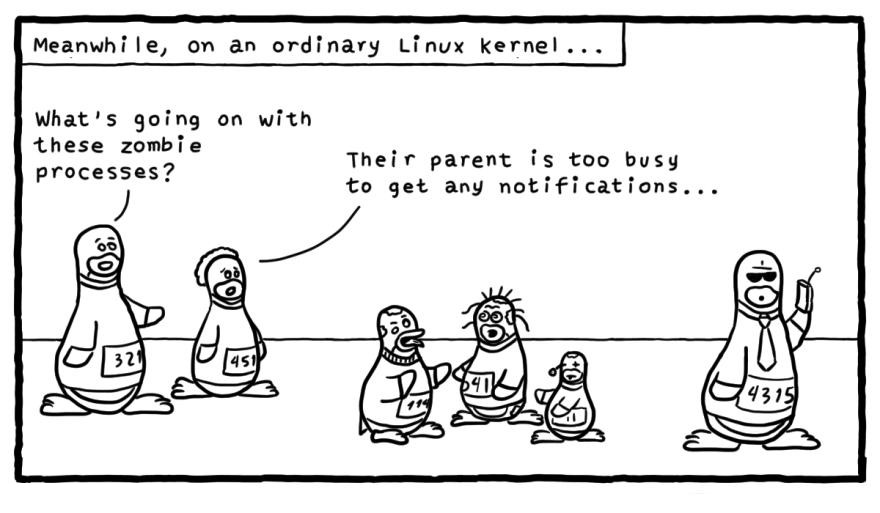

## How To Kill Zombie Processes on Linux ##

### Killing Zombies! ###
Also known as “defunct” or “dead” process – In simple words, a Zombie process is one that is dead but is present in the system’s process table. Ideally, it should have been cleaned from the process table once it completed its job/execution but for some reason, its parent process didn’t clean it up properly after the execution.

In a just (Linux) world, a process notifies its parent process once it has completed its execution and has exited. Then the parent process would remove the process from process table. At this step, if the parent process is unable to read the process status from its child (the completed process), it won’t be able to remove the process from memory and thus the process being dead still continues to exist in the process table – hence, called a ***Zombie!***

In order to kill a Zombie process, we need to identify it first. The following command can be used to find zombie processes:
```
$ ps aux | egrep "Z|defunct"
```
**Z** in the STAT column and/or **[defunct]** in the last (COMMAND) column of the output would identify a Zombie process.

Now practically you can’t kill a Zombie because it is already dead! What can be done is to notify its parent process explicitly so that it can retry to read the child (dead) process’s status and eventually clean them from the process table. This can be done by sending a **SIGCHLD** signal to the parent process. The following command can be used to find the parent process ID (PID):
```
$ ps -o ppid= <Child PID>
```
Once you have the Zombie’s parent process ID, you can use the following command to send a SIGCHLD signal to the parent process:
```
$ kill -s SIGCHLD <Parent PID>
```
However, if this does not help clearing out the Zombie process, you will have to kill or restart its parent process OR in case of a huge surge in Zombie processes causing or heading towards system outage, you will have no choice but to go for a system reboot. The following command can be used to kill its parent process:
```
$ kill -9 <Parent PID>
```
Note that killing a parent process will affect all of its child processes, so a quick double check will be helpful to be safe. Alternatively, if few lying zombie processes are not consuming much CPU/Memory, it’s better to kill the parent process or reboot the system in the next scheduled system maintenance.